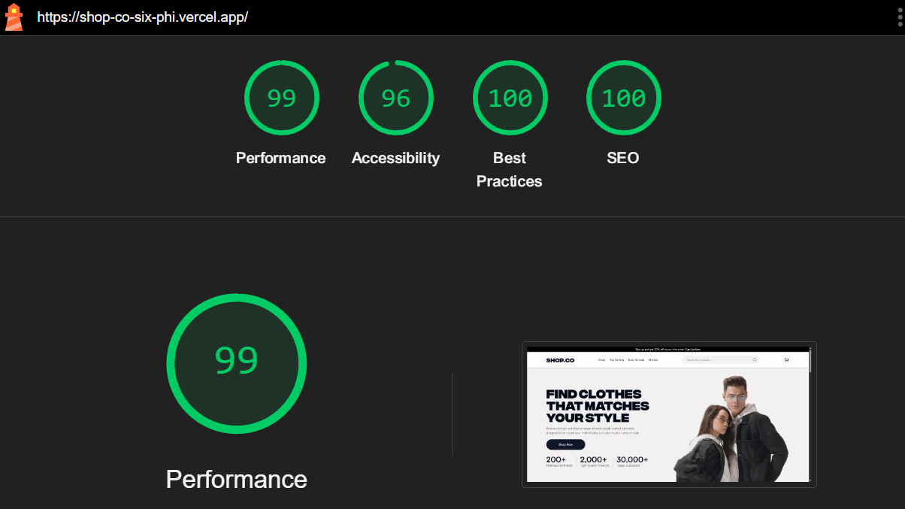
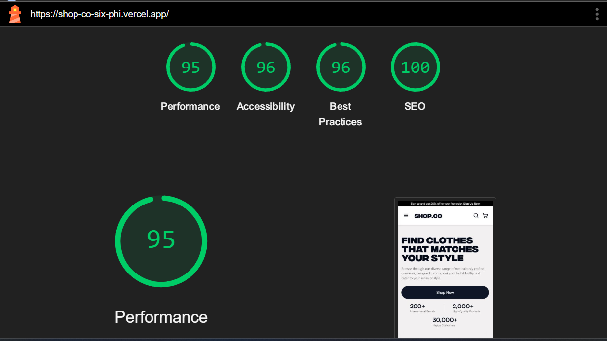

# 🛍️ Shop.co – Frontend E-commerce UI

**Live Demo**: [https://shop-co-six-phi.vercel.app](https://shop-co-six-phi.vercel.app)

**Shop.co** is a sleek and responsive frontend UI for an e-commerce platform, built with **Next.js 14**, **TypeScript**, **Tailwind CSS**, and **Framer Motion**. It demonstrates a modern shopping experience with animated interactions and mobile-first design — ideal for integration with any backend or headless CMS.

---

## 🎯 Key Features

- 📱 **Responsive Design** – Fully optimized for mobile, tablet, and desktop
- 🧭 **Smart Navigation** – Hides on scroll down, shows on scroll up
- 🔍 **Search Bar** – Toggleable mobile search UI
- 🛒 **Cart UI & Actions** – Add to cart logic (mocked for frontend)
- 🎨 **Framer Motion** – Smooth animations for navbar and UI elements
- 💅 **Clean Codebase** – Built with reusable components, consistent style

---

## 🚄 Performance & Optimization

### Desktop Performance



### Mobile Performance



---

## 🧱 Tech Stack

- [Next.js 14 (App Router)](https://nextjs.org/docs)
- [React](https://reactjs.org/)
- [TypeScript](https://www.typescriptlang.org/)
- [Tailwind CSS](https://tailwindcss.com/)
- [Framer Motion](https://www.framer.com/motion/)

---

## 📁 Project Structure

```
shop.co/
├── app/ # App Router structure (layouts, pages)
├── components/ # Reusable UI components
├── public/ # Static assets (images, SVGs)
├── styles/ # Tailwind config and globals
├── lib/ # Utility functions (optional)
├── store/ # State management (Context or mock)
├── next.config.ts # Next.js configuration
├── tailwind.config.ts # Tailwind CSS setup
├── tsconfig.json # TypeScript config
└── package.json # Dependencies and scripts
```

---

## 🛠️ Getting Started

### Prerequisites

- Node.js (v16 or higher)
- npm

### Setup

```bash
# Clone the repo
git clone https://github.com/GopiSVDev/shop.co.git
cd shop.co

# Install dependencies
npm install

# Run the development server
npm run dev

# Visit in browser
http://localhost:3000
```

---

## 🧪 Available Scripts

| Script  | Description                 |
| ------- | --------------------------- |
| `dev`   | Run in development mode     |
| `build` | Build the production app    |
| `start` | Start the production server |
| `lint`  | Run ESLint on the codebase  |

---

## 🧑‍🎨 UI Design Credit

This UI was originally designed by **[https://www.figma.com/@hamzauix]**. Huge thanks to him for the inspiration and layout. This project builds upon his design for educational and portfolio use.

---
